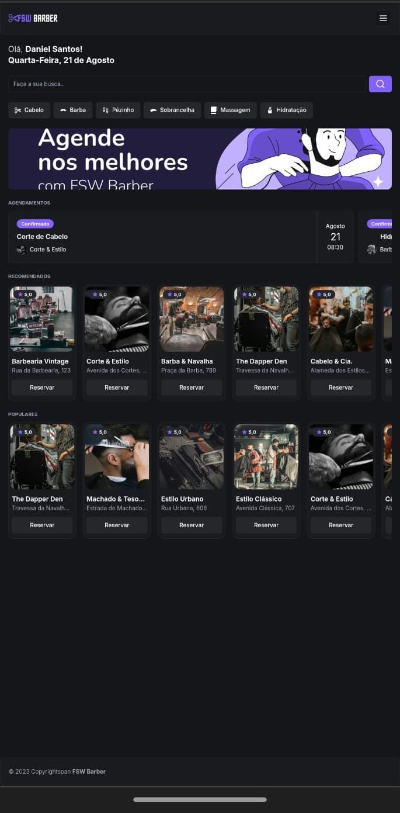
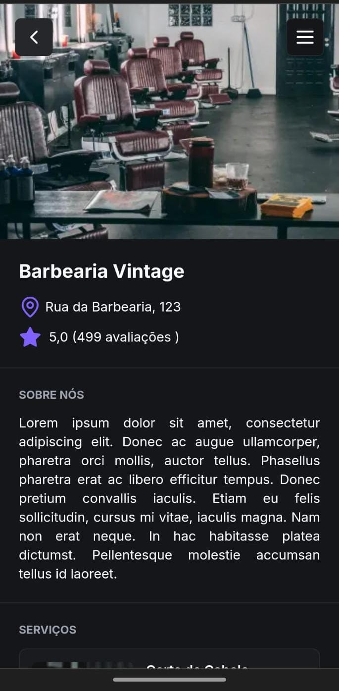
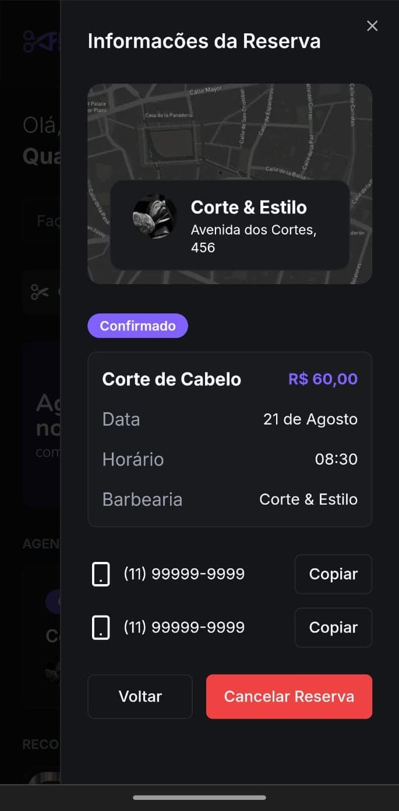

Este repositório contém o projeto desenvolvido durante o evento **Full Stack Week**.


## Preview da Aplicação
## Acesse


Link do  projeto em funcionamento: [FSW Barber](https://fsw-barber-omega-gold.vercel.app/)


## Tecnologias Utilizadas


[](https://nextjs.org/)
[](https://reactjs.org/)
[](https://www.postgresql.org/)
[](https://tailwindcss.com/)
[](https://www.prisma.io/)
[](https://nodejs.org/)
[](https://ui.shadcn.com/)
[](https://www.typescriptlang.org/)
[](https://developer.mozilla.org/en-US/docs/Web/JavaScript)


##  Componentes ShadCN


```plaintext
shadcn/
└── ui/
    ├── avatar.tsx       # Representa um avatar de usuário, usado para imagens de perfil.
    ├── badge.tsx        # Exibe pequenas etiquetas ou contadores, geralmente para notificações.
    ├── button.tsx       # Um botão clicável para ações do usuário.
    ├── calendar.tsx     # Um calendário para seleção de datas.
    ├── card.tsx         # Agrupa informações relacionadas de forma visual.
    ├── dialog.tsx       # Um modal para mostrar informações adicionais ou pedir confirmação.
    ├── form.tsx         # Captura dados de entrada do usuário.
    ├── input.tsx        # Campo de entrada para inserção de dados pelo usuário.
    ├── label.tsx        # Identifica campos de entrada ou outras partes da interface.
    ├── sheet.tsx        # Painel deslizante para informações ou controles adicionais.
    └── sonner.tsx       # Componente personalizado, possivelmente para notificações.
```
# Modelagem do Banco de Dados
```plaintext
+------------------+    +------------------+    +------------------+    +------------------+
|      User        |    |     Booking      |    |  Barbershop      |    |  Barbershop      |
+------------------+    +------------------+    |      Service     |    |                  |
| ID (PK)          |    | ID (PK)          |    +------------------+    +------------------+
| Name             |    | Service ID (FK)  |    | ID (PK)          |    | ID (PK)          |
| E-mail           |    | Barbershop ID (FK)|   | Barbershop ID (FK)|   | Name             |
+------------------+    | User ID (FK)     |    | Name             |    | Description      |
                        | Date             |    | Description      |    | Address          |
                        +------------------+    | Image URL        |    | Image URL        |
                                                 | Price            |    +------------------+
                                                 +------------------+


```
| Tabela               | Coluna           | Tipo         | Descrição                          |
|----------------------|------------------|--------------|------------------------------------|
| **User**             | ID               | Primary Key  | Identificador único do usuário     |
|                      | Name             | String       | Nome do usuário                    |
|                      | E-mail           | String       | E-mail do usuário                  |
|                      |                  |              |                                    |
| **Barbershop**       | ID               | Primary Key  | Identificador único da barbearia   |
|                      | Name             | String       | Nome da barbearia                  |
|                      | Description      | Text         | Descrição da barbearia             |
|                      | Address          | String       | Endereço da barbearia              |
|                      | Image URL        | String       | URL da imagem da barbearia         |
|                      |                  |              |                                    |
| **Barbershop Service** | ID             | Primary Key  | Identificador único do serviço     |
|                      | Barbershop ID    | Foreign Key  | ID da barbearia associada          |
|                      | Name             | String       | Nome do serviço                    |
|                      | Description      | Text         | Descrição do serviço               |
|                      | Image URL        | String       | URL da imagem do serviço           |
|                      | Price            | Decimal      | Preço do serviço                   |
|                      |                  |              |                                    |
| **Booking**          | ID               | Primary Key  | Identificador único do agendamento |
|                      | Service ID       | Foreign Key  | ID do serviço associado            |
|                      | Barbershop ID    | Foreign Key  | ID da barbearia associada          |
|                      | User ID          | Foreign Key  | ID do usuário associado            |
|                      | Date             | DateTime     | Data do agendamento                |


## Instalação


Para rodar o projeto localmente, siga os passos abaixo:


1. Clone o repositório:
    ```bash
    git clone git@github.com:danielstos/fsw-barber.git
    ```


2. Instale as dependências:
    ```bash
    npm install
    ```


3. Configure as variáveis de ambiente:
    ```plaintext
    DATABASE_URL=seu-database-url
    ```


4. Execute as migrações do banco de dados:
    ```bash
    npx prisma migrate dev
    ```


5. Inicie o servidor de desenvolvimento:
    ```bash
    npm run dev
    ```


<div style="display: flex; flex-wrap: wrap; gap: 10px;">
    
    
    
    
    
</div>


## Contato


- **Nome**: Daniel Santos
- **LinkedIn**: [Daniel Stos](https://www.linkedin.com/in/daniel-stos/)
- **Repositório GitHub**: [fsw-barber](https://github.com/danielstos/fsw-barber)


