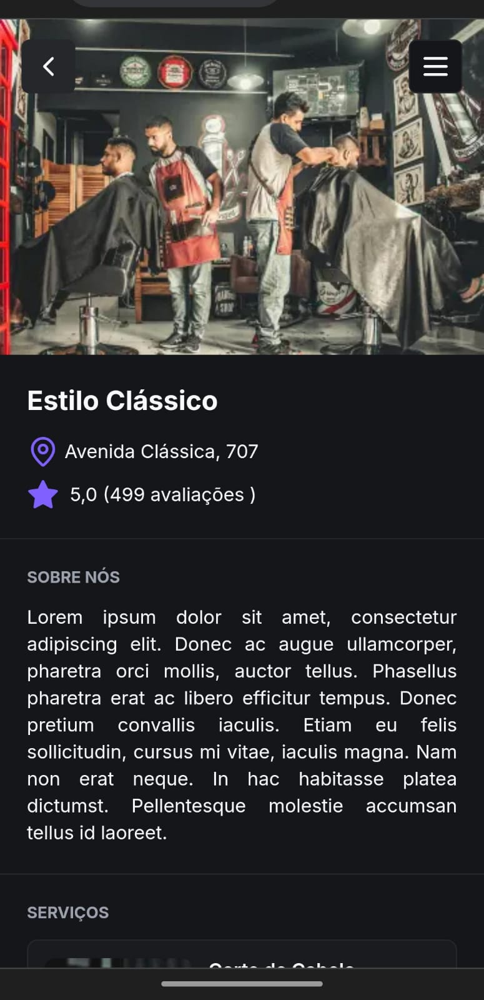

# FSW Barber

Este repositório contém o projeto desenvolvido durante o evento **Full Stack Week**.

## Preview da Aplicação
## Demo

Confira o projeto em funcionamento: [FSW Barber](https://fsw-barber-omega-gold.vercel.app/)

### Visualização em GIF


### Visualização em JPEG





## Tecnologias Utilizadas

- **Next.js**
- **React.js**
- **PostgreSQL**
- **Tailwind CSS**
- **Prisma**
- **Node.js**
- **ShadCN**
- **TypeScript**
- **JavaScript**

## Instalação

Para rodar o projeto localmente, siga os passos abaixo:

1. Clone o repositório:
    ```bash
    git clone git@github.com:danielstos/fsw-barber.git
    ```

2. Instale as dependências:
    ```bash
    npm install
    ```

3. Configure as variáveis de ambiente:
    ```plaintext
    DATABASE_URL=seu-database-url
    ```

4. Execute as migrações do banco de dados:
    ```bash
    npx prisma migrate dev
    ```

5. Inicie o servidor de desenvolvimento:
    ```bash
    npm run dev
    ```


## Contato

- **Nome**: Daniel Stos
- **LinkedIn**: [Daniel Stos](https://www.linkedin.com/in/daniel-stos/)
- **Repositório GitHub**: [fsw-barber](https://github.com/danielstos/fsw-barber)
